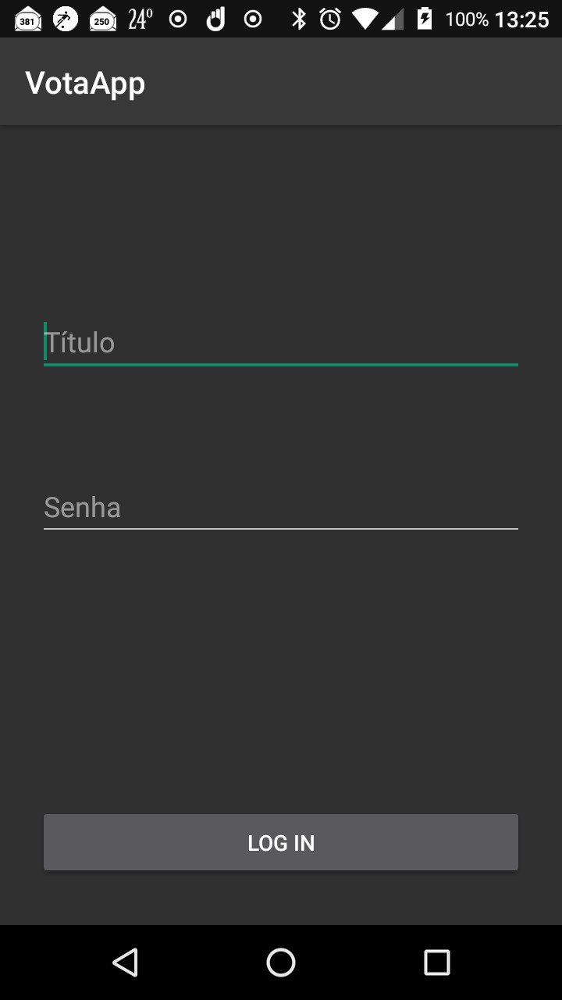
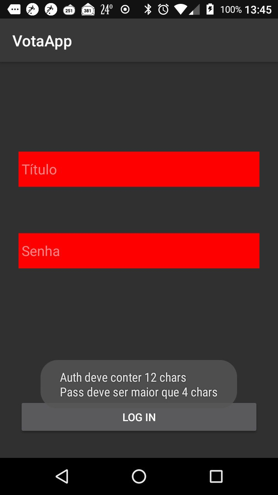
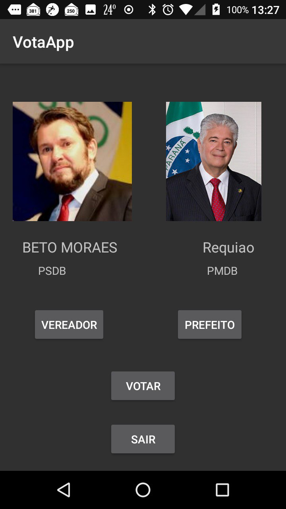
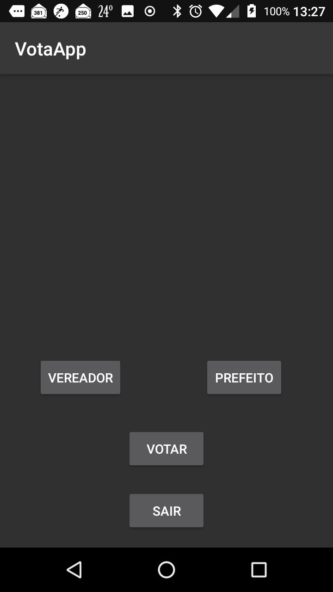
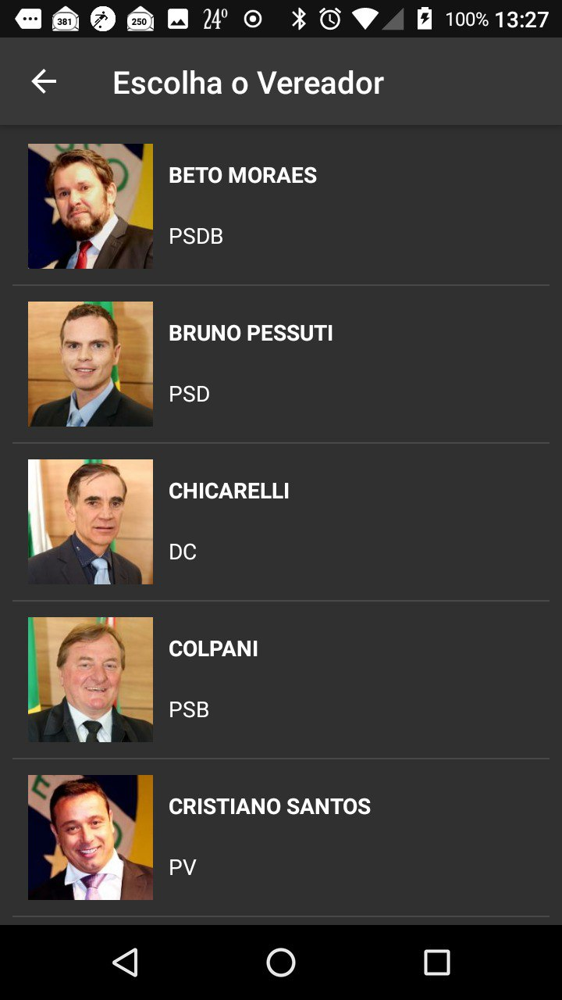
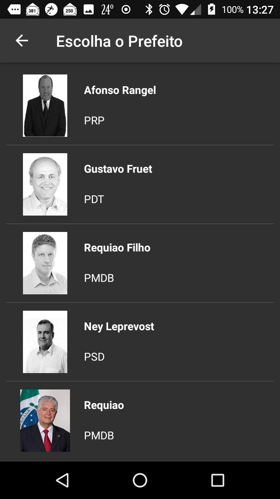
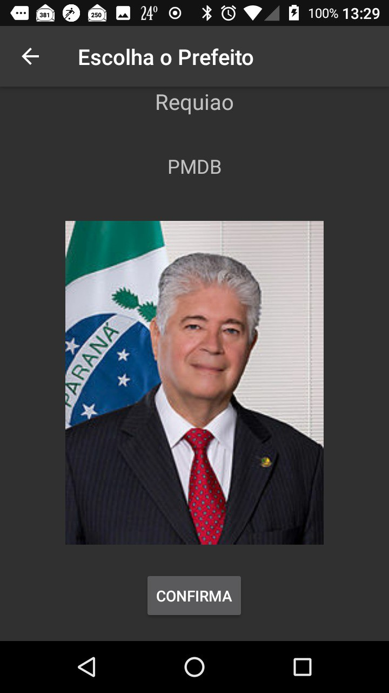
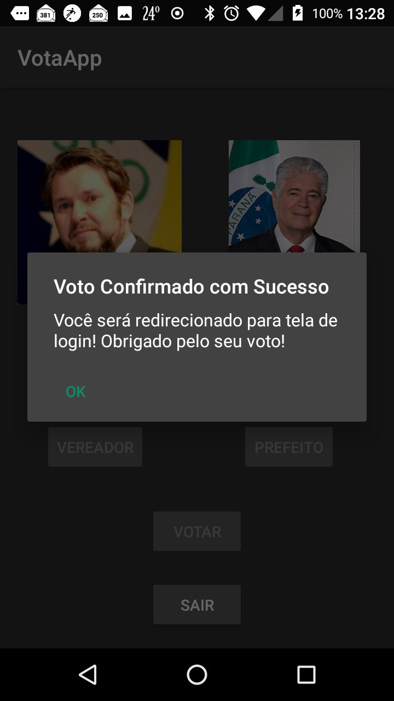
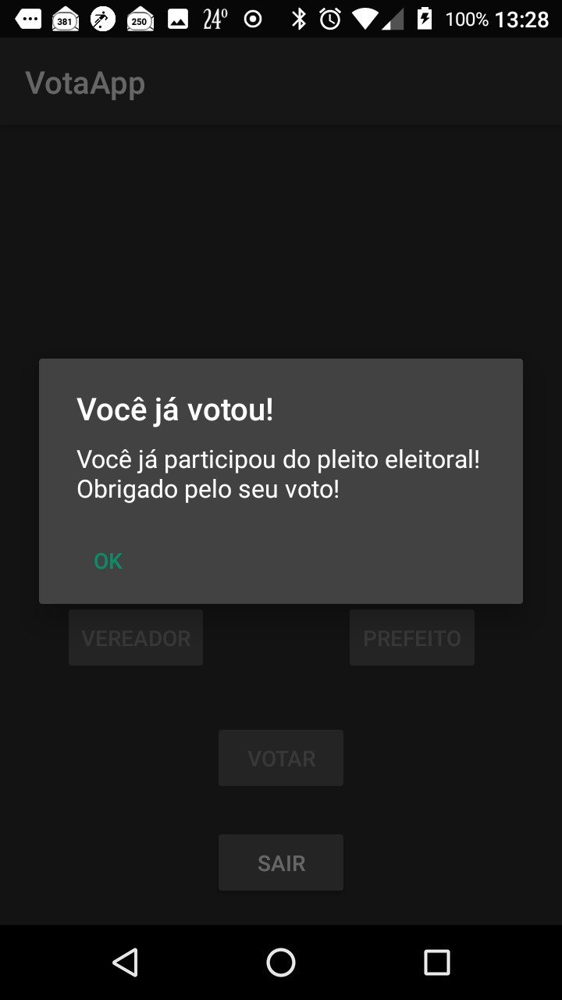

# VotaAPP

The idea of the app is to help in the vote proccess, that way users will no longer necessarily be at his vote zone. With this app,
the users has total convenience to vote at home. It's very simple, just go to the app store, download the app and login with his 
voter registration and password alredy saved in database. 

## Setup

This project uses [VotaAppServer](https://github.com/Calebe94/VotaAppServer) as its backend. Be sure this backend is running at http://www.kairos-dev.tk/api/ before run this app.

After this verification import this project in your [Android Studio](https://developer.android.com/studio/), make sure the API 16 for Android 4.1 (Jelly Bean), build the project and pray to God. 

## Screens

### Login Screen

| Login | Wrong Password |
|:-----:|:------:|
|  | 

### Main Screen

| Empty | Filled |
|:-----:|:------:|
|  |  |

### Candidates List

| Councilors | Mayors |
|:-----:|:------:|
|  |  |

### Candidate Info

| Councilor | Mayor |
|:-----:|:------:|
|  |  |

### Alerts

| Vote Confirmed | You Have Already Voted |
|:--------------:|:----------------------:|
|  |  |

# Team

|  |  | 
|:---------------------------------------------------------------------------------:|:------------------------------------------------------------------:|
| [Edimar Calebe Castanho (Calebe94)](https://github.com/Calebe94)                  | [Hans Schedel (thecobra159)](https://github.com/thecobra159)

# License

All software is covered under [MIT License](https://opensource.org/licenses/MIT).

Permission is hereby granted, free of charge, to any person obtaining a copy of this software and associated documentation files (the "Software"), to deal in the Software without restriction, including without limitation the rights to use, copy, modify, merge, publish, distribute, sublicense, and/or sell copies of the Software, and to permit persons to whom the Software is furnished to do so, subject to the following conditions:

The above copyright notice and this permission notice shall be included in all copies or substantial portions of the Software.

THE SOFTWARE IS PROVIDED "AS IS", WITHOUT WARRANTY OF ANY KIND, EXPRESS OR IMPLIED, INCLUDING BUT NOT LIMITED TO THE WARRANTIES OF MERCHANTABILITY, FITNESS FOR A PARTICULAR PURPOSE AND NONINFRINGEMENT. IN NO EVENT SHALL THE AUTHORS OR COPYRIGHT HOLDERS BE LIABLE FOR ANY CLAIM, DAMAGES OR OTHER LIABILITY, WHETHER IN AN ACTION OF CONTRACT, TORT OR OTHERWISE, ARISING FROM, OUT OF OR IN CONNECTION WITH THE SOFTWARE OR THE USE OR OTHER DEALINGS IN THE SOFTWARE.
